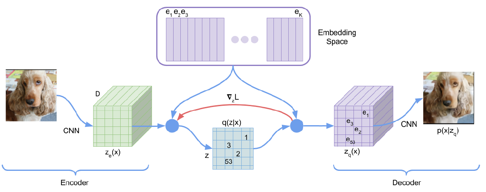

# PyTorch VQVAEs

This repository contains PyTorch implementations of various Vector Quantized Variational Autoencoders (VQVAEs).

I created this project to explore and better understand VQVAEs through hands-on implementation. My journey began with curiosity about the NeurIPS 2024 best paper: [Visual Autoregressive Modeling: Scalable Image Generation via Next-Scale Prediction](https://arxiv.org/abs/2404.02905), which inspired me to dive deeper into the underlying VQVAE architectures.



## Table of Contents
  * [What are VQVAEs?](#what-are-vqvaes)
  * [Implementations](#implementations)
    + [VQ-VAE](#vq-vae)
    + [VQ-VAE-2](#vq-vae-2)
    + [VQ-GAN](#vq-gan)
    + [RVQ-VAE](#rvq-vae)
    + [DALL-E](#dall-e)
    + [MaskGIT](#maskgit)
    + [Stable Diffusion](#stable-diffusion)

## Installation

Clone this repository and install the dependencies:

```bash
git clone git@github.com:hoanhle/vqvae.git
cd vqvae-pytorch
conda env create -f environment.yml
```

## Implementations

## VQ-VAE

Implementation based on the [VQ-VAE paper](https://arxiv.org/abs/1711.00937).


## Increasing codebook usage

Codebook collapse happens frequently in VQ-VAE models, where only a small portion of the codebook entries are used while others remain inactive or "dead." This underutilization reduces the model's representational capacity and can lead to poor performance. 

This repository will contain a few techniques from various papers to combat "dead" codebook entries, which is a common problem when using vector quantizers.

[CVQ-VAE](https://arxiv.org/abs/2307.15139) prevents collapse by identifying underutilized ("dead") codevectors and reinitializing them using "anchors" sampled from the encoded features. This strategy encourages these codebook vectors to align more closely with the distribution of the encoded features, enhancing their likelihood of being chosen and optimized in subsequent training iterations.


## Citations

```bibtex
@misc{oord2018neural,
    title   = {Neural Discrete Representation Learning},
    author  = {Aaron van den Oord and Oriol Vinyals and Koray Kavukcuoglu},
    year    = {2018},
    eprint  = {1711.00937},
    archivePrefix = {arXiv},
    primaryClass = {cs.LG}
}
```

```bibtex
@misc{zheng2023onlineclusteredcodebook,
      title={Online Clustered Codebook}, 
      author={Chuanxia Zheng and Andrea Vedaldi},
      year={2023},
      eprint={2307.15139},
      archivePrefix={arXiv},
      primaryClass={cs.CV},
      url={https://arxiv.org/abs/2307.15139}, 
}
```