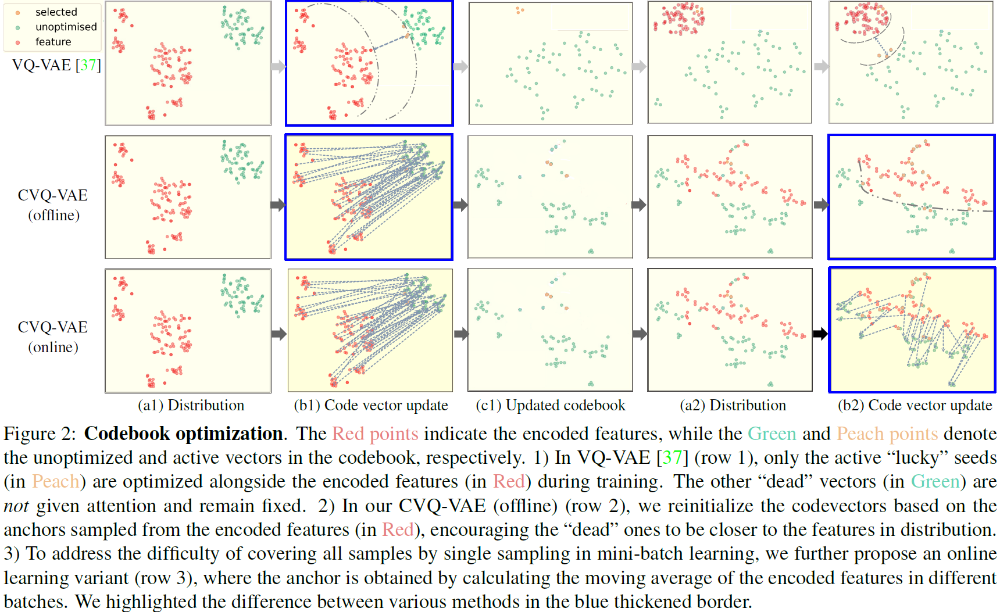

# PyTorch Vector Quantized Variational Autoencoders

This repository contains PyTorch implementations of various Vector Quantized Variational Autoencoders (VQVAEs).

I created this project to explore and better understand VQVAEs through hands-on implementation. My journey began with curiosity about the NeurIPS 2024 best paper: [Visual Autoregressive Modeling: Scalable Image Generation via Next-Scale Prediction](https://arxiv.org/abs/2404.02905), which inspired me to dive deeper into the underlying VQVAE architectures.


## Table of Contents
  * [What are VQVAEs?](#what-are-vqvaes)
  * [Implementations](#implementations)
    + [VQ-VAE](#vq-vae)
    + [VQ-VAE-2](#vq-vae-2)
    + [VQ-GAN](#vq-gan)
    + [RVQ-VAE](#rvq-vae)
    + [DALL-E](#dall-e)
    + [MaskGIT](#maskgit)
    + [Stable Diffusion](#stable-diffusion)

## Installation

Clone this repository and install the dependencies:

```bash
git clone git@github.com:hoanhle/vqvae.git
cd vqvae-pytorch
conda env create -f environment.yml
```

## Implementations

## VQ-VAE

Implementation based on the [VQ-VAE paper](https://arxiv.org/abs/1711.00937).

VQ-VAE learns a discrete latent representation of the data by combining a encoder, a shared codebook, and a decoder. The encoder $E(x)$ maps an input $x$ (e.g. an image) to a feature map of size $H \times W \times D$, which we view as $N=H \times W$ separate $D$-dimensional vectors $z_i$. Each $z_i$ is then independently quantized by finding its nearest neighbor in the codebook:

$$
k_i = \arg\min_j \|z_i - e_j\|,\quad e_i = e_{k_i}.
$$

producing a discrete latent tensor of the same spatial dimensions. The decoder $D(e)$ takes this quantized representation and reconstructs the input.

Training minimizes a three-term loss. The reconstruction term $\|x-D(e)\|^2$ encourages the output to resemble the input. The codebook term $\sum_i\left\|{sg}\left[z_i\right]-e_i\right\|^2$ moves each selected codebook vector closer to the encoder outputs that get assigned to it (where "sg" is the stop-gradient operator). The commitment term $\beta \sum_i\left\|{sg}\left[e_i\right]-z_i\right\|^2$, encourages the outputs of the encoder to stay close
to the chosen codebook vector, prevents the encoder outputs from fluctuating too frequently between code vectors; $\beta$ is a user-chosen hyperparameter. Altogether:
  
$$
\mathcal{L}(x)=\|x-D(e)\|^2+\sum_i\left\|{sg}\left[z_i\right]-e_i\right\|^2+\beta \sum_i\left\|{sg}\left[e_i\right]-z_i\right\|^2
$$


Rather than back-propagating into the codebook, VQ-VAE updates each codebook entry $e_j$ via exponential moving averages over all $z_i$ assigned to it during training, which is a more efficient approach.

```python
import torch
from models.vqvae import VectorQuantizer

vq = VectorQuantizer(
    embedding_dim = 32,
    num_embeddings = 512,
    use_ema = True, # use the exponential moving average updates for the codebook, as a replacement for the codebook loss
    decay = 0.99,
    epsilon = 1e-5,
)
```

## Increasing codebook usage

Codebook collapse happens frequently in VQ-VAE models, where only a small portion of the codebook entries are used while others remain inactive or "dead." This underutilization reduces the model's representational capacity and can lead to poor performance. 

This repository will contain a few techniques from various papers to combat "dead" codebook entries, which is a common problem when using vector quantizers.

[CVQ-VAE](https://arxiv.org/abs/2307.15139) prevents collapse by identifying underutilized ("dead") codevectors and reinitializing them using "anchors" sampled from the encoded features. This strategy encourages these codebook vectors to align more closely with the distribution of the encoded features, enhancing their likelihood of being chosen and optimized in subsequent training iterations.



```python
import torch
from models.vqvae import VectorQuantizer

vq = VectorQuantizer(
    embedding_dim = 32,
    num_embeddings = 512,
    use_ema = True,
    decay = 0.99,
    epsilon = 1e-5,
    online_update = True,
    anchor = "random",
)
```

## Viewer

There is a currently a prototype viewer under development. It allows you to view the input image, the reconstructed image, and the encoding indices
of a trained VQ-VAE model.

You can run the viewer with:

```bash
python viewer.py --checkpoint <path_to_checkpoint>
```


## Citations

```bibtex
@misc{oord2018neural,
    title   = {Neural Discrete Representation Learning},
    author  = {Aaron van den Oord and Oriol Vinyals and Koray Kavukcuoglu},
    year    = {2018},
    eprint  = {1711.00937},
    archivePrefix = {arXiv},
    primaryClass = {cs.LG}
}
```

```bibtex
@misc{zheng2023onlineclusteredcodebook,
      title={Online Clustered Codebook}, 
      author={Chuanxia Zheng and Andrea Vedaldi},
      year={2023},
      eprint={2307.15139},
      archivePrefix={arXiv},
      primaryClass={cs.CV},
      url={https://arxiv.org/abs/2307.15139}, 
}
```

```bibtex
@misc{tian2024visualautoregressivemodelingscalable,
      title={Visual Autoregressive Modeling: Scalable Image Generation via Next-Scale Prediction}, 
      author={Keyu Tian and Yi Jiang and Zehuan Yuan and Bingyue Peng and Liwei Wang},
      year={2024},
      eprint={2404.02905},
      archivePrefix={arXiv},
      primaryClass={cs.CV},
      url={https://arxiv.org/abs/2404.02905}, 
}
```

```bibtex
@misc{oord2016conditionalimagegenerationpixelcnn,
      title={Conditional Image Generation with PixelCNN Decoders}, 
      author={Aaron van den Oord and Nal Kalchbrenner and Oriol Vinyals and Lasse Espeholt and Alex Graves and Koray Kavukcuoglu},
      year={2016},
      eprint={1606.05328},
      archivePrefix={arXiv},
      primaryClass={cs.CV},
      url={https://arxiv.org/abs/1606.05328}, 
}
```